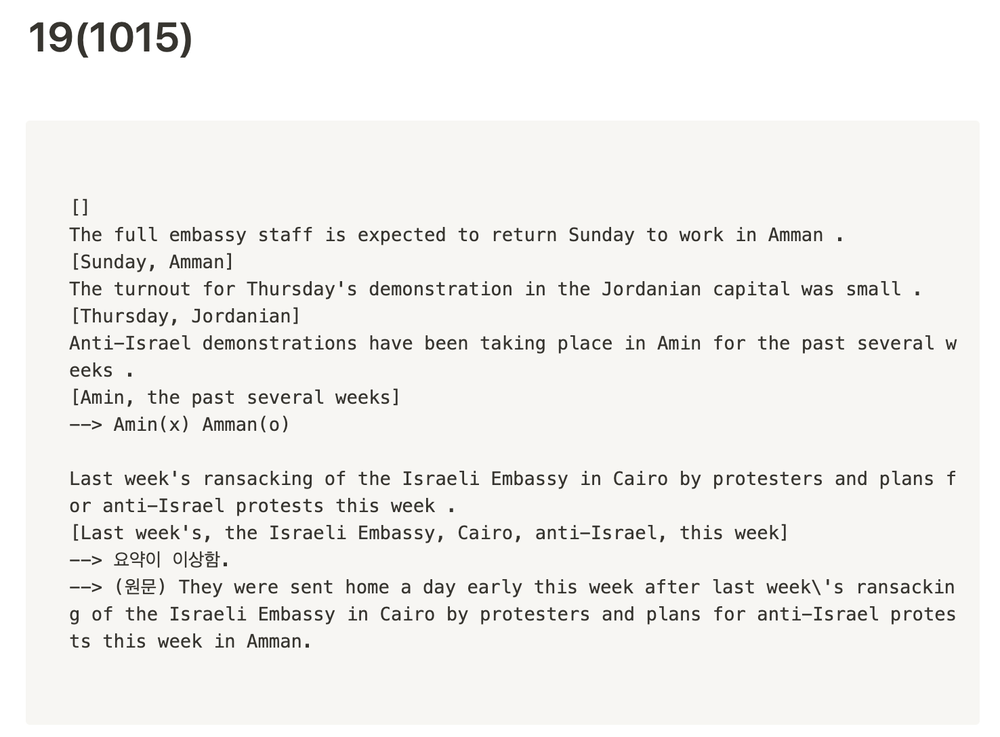
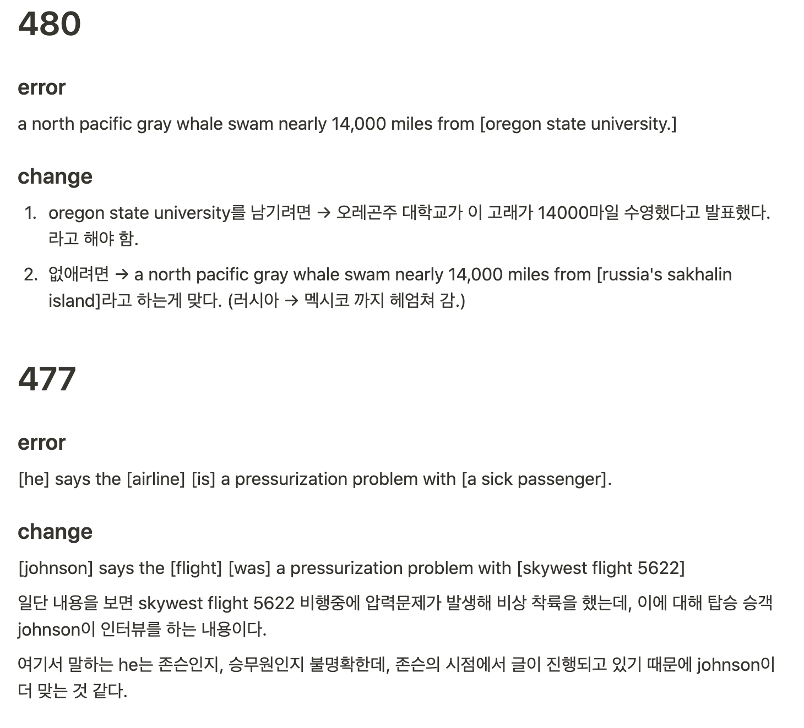

# KNU_NLP Undergraduate intern log
- KNU Natural Language Processing lab 
- 2020.2~

# [2월] AI 공부
- [Pytorch로 시작하는 딥 러닝 입문](https://wikidocs.net/book/2788)
- [Seq2Seq 논문](seq2seq.pdf)리뷰 세미나

# [3월] Ubuntu 서버 구축

- 예비서버가 해킹당해서 다시 서버구축함
- 추후 이런일이 있을 수 있어서 [매뉴얼](https://www.notion.so/Ubuntu-16-04-server-0a8543df4cb141f986e7b09d181188f2)화 시켜놓음
- Ubuntu 16.04
- Docker
- Anaconda

# [3월~] 서버관리
- GPU 사용량 관리
- 형태소 분석기 꺼졌는지 확인
- API status 운영 확인
- API status 통신 방식 전환(get->post)

# [3월~] Fact correction
### 요약문에서 틀린 NE와 그 이유 찾기
- ETRI, Spacy API를 돌려 나온 형태소들을 정해진 형식의 json으로 반환하기
- CNN/Dailymail, 경희대 요약에서 틀린 NE찾기
- 
- SKT KoBART 돌려보기

### 원문과 요약문 비교
- 틀린 요약문과 원문을 비교하여 왜 틀렸는지 이유 찾기
- 

# [4월] [QAGS 논문리뷰](https://www.notion.so/Asking-and-Answering-Questions-to-Evaluate-the-Factual-Consistency-of-Summaries-9396ef72bfdb42c5a7303ac961923eda) 세미나
- abstractive summarization의 factual correction을 평가하기 위한 메트릭
- QG -> BART 공부필요
- QA -> BERT, transformer 공부 필요

# [5월] '심층학습' 스터디
- 
- NOW: 선형대수 파트
- CS224N 강의(NLP stanford)
